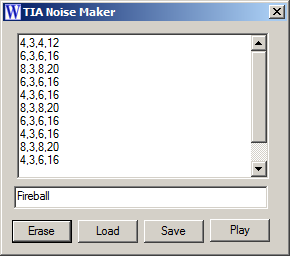
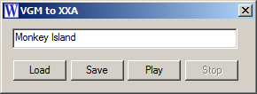
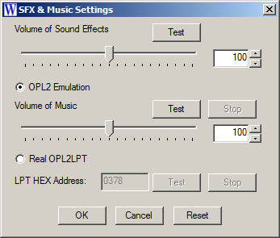
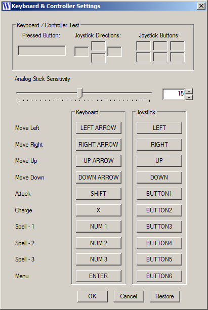

<h2>Xerxes - A game created in Winteracter Fortran</h2>
 

You may ask, why would anyone do this? I would answer: <b>Why do nobody do this? :D </b>

The project is in a really early stage, but some parts are completed:

<h3><i>Sound Effects</i></h3>

For sound effects, I added a complete TIA (Atari 2600 graphics and sound chip) audio emulation. So the game will have perfect 1977s sound effects. The editor accepts plain text, VOL, CHANNEL, FREQUENCY and DURATION for every tones and plays 4 channels, so you can say, it's double TIA. The sound effects are stored as XXT files.

<h3><i>Music</i></h3>

For music, the game uses the Yamaha 3812 (OPL2 - Adlib). By default, it's emulated in software, but there is a possibility to play music on an OPL2LPT or compatible sound card, if the computer has an LPT port and the OS allows it. The port is reached thru inpout32.dll. In the future, it's possible that I add an USB possibility if I build my own sound card. The music is stored as XXA, which is a gzipped, more compact VGM format, only allowing OPL2. The program has a tool to convert VGM to XXA.

<h3><i>SFX and Music Settings</i></h3>

The game engine allows the user to change the volume for music and sound, and also set the hex address of LPT port.

<h3><i>Controller Settings</i></h3>

The game can be controlled thru the keyboard and joysticks, even old analog joystics or XBox360 style controllers. The menu let's you test the buttons and the controllers as well (4 directions and 6 buttons). The sensitivity of analog joysticks can be set as well.

<h3><i>Tests</i></h3>

The game is developed on Windows 7 with Winteracter 17 and Intel Fortran 15. After changing the exe header manually, I can run the game on XP (emulated), but seemed really slow in threading, I will do it on a real HW soon. My Win 2003 server died on the Kernel32 interfaces, so it's not compatible. I also run the game on Windows 11, the only thing that refused to compete is the inpout32.dll, so using OPL2LPT on this machine is not possible.

